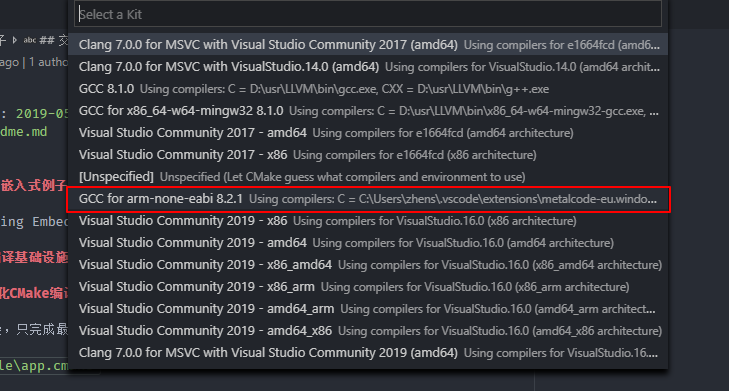

改进CMake工程，解决编译选项的污染问题！

# zsESamples-嵌入式例子

Samples Learning Embedded Linux

## 以CMake为编译基础设施

### 基本的层次化CMake编译描述

在编译工程不复杂，只完成最简单的编译任务，且源文件都在一个文件夹中时，可以采用这种组织方式

见`cmake\single\app.cmake`

### 可订制的编译描述

将一个描述文件分成三部分，第一部分为公共部分定义一些变量，第二部分用户自定义区，第三部分为

## 交叉编译

基于vscode的CMakeTools插件，选择交叉编译器进行构建，这样不用在CMakeLists中显示构造toolchain文件
只需在工具栏切换工具链即可，如果需要自动化，在cmake 命令行选项中加入工具链即可

~~工具链借助vscode的插件下载和更新~~

使用单板自带的工具链！

~~将`C:\Users\zhens\.vscode\extensions\metalcode-eu.windows-arm-none-eabi-0.1.6\bin`添加到path
然后cmaketools就会自动发现该工具链, 或者执行vscode命令 ``cmake scan for kits`~~

不添加到path中，使用`cmake-kits.json`，显式定义

```json
    {
        "name": "GCC for arm-none-eabi zs",
        "toolchainFile": "${workspaceRoot}/cmake/toolchain/arm-none-eabi.cmake",
        "preferredGenerator": {
            "name": "Unix Makefiles"
        },
        "cmakeSettings":{
            "cmake.generator": "Unix Makefiles"
        },
        "environmentVariables": {}
    }
```

- 裸板交叉编译只能静态连接，所以把编译描述都静态了



### 交叉编译下的单元测试问题

在windows下单元测试采用mingw工具链，可以直接运行单元测试

更换arm工具链后，需要重新编译gtest的库，到`tools/lib/arm`中，且不能直接运行单元测试执行文件，但可以通过debug调试


### 复制目标文件到target目录

- 使用vscode的task功能复制文件，暂不实现，手动复制到ftp服务器，也不打包，因为需要uboot的支持
- task编写时考虑环境变量，将目标文件复制到`target/${buildKit}/${buildType}/`

[cmake-tools配置参考文档](https://vector-of-bool.github.io/docs/vscode-cmake-tools/settings.html)

todo: 后续使用CMake的功能做到编译，复制，安装功能

## 裸板程序

### 裸机程序的烧写

- 使用vscode的task功能实现，基于eop，使用oflash.exe进行烧写，可以烧到nor，也可以烧写到nand
- 也可以使用openOCD进行烧写，不过只能烧写到norFlash
- 懒得重新装uboot，可以使用openOCD烧uboot到nor，然后使用uboot通过ftp将程序拷贝到nand，然后从nand启动就可以了

### 裸机程序的调试

- 一般通过openOCD来调试，比较麻烦
- 通过gdb和openocd一起进行源码级调试
- 这里使用vscode的插件，使用gdb调试裸板程序

## 应用程序

写应用程序之前恐怕得先升级内核到最新版，升级内核恐怕得升级uboot

### 应用程序的调试

使用gdb-server进行远程调试

### 写日志

涉及到外部库

### 测试传感器

涉及到驱动开发了，引用驱动库

### 并发程序

### 网络程序

### debug shell

这个太难了，暂不考虑。可以考虑部署一个中间件了

如果是实时中间件的话，要编译实时内核，如ucLinux或RTLinux，不过ucLinux不支持mmu，可以考虑RTLinux

## 应用程序进阶

### 移植dropbear-ssh服务

[参考页面](https://blog.csdn.net/alangdangjia/article/details/8736872)

### 移植python binding

这个是规划

### CMake扩展

单元测试，性能测试，安装，打包功能

[vscode 与 CMake真是天作之合](https://zhuanlan.zhihu.com/p/52874931)
[how-to-cross-compile-with-cmake-arm-none-eabi-on-windows](https://stackoverflow.com/questions/43781207/how-to-cross-compile-with-cmake-arm-none-eabi-on-windows)
[新cmake实战](https://www.jianshu.com/p/aaa19816f7ad)
